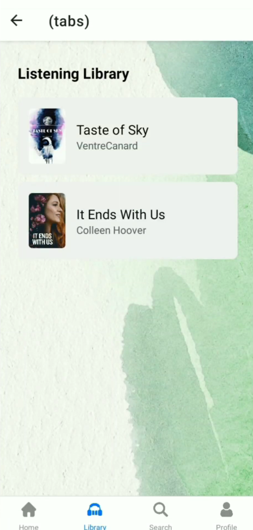

# Talking Book
Talking Book App.
https://youtube.com/shorts/EQw45u_MqQk?feature=share

# Features
* Audio Playback Controls
* Personalization and Customization
* Discovery and Search
* Accessibility Features

# Course Overview
* Voice Narration and Performance
* User Registration & Authenticaiton
* Narration Techniques

# Tech Stack
* React Native
* AppWrite
* HTML, CSS and JS

# Home Screen
  

# Sign Up Screen
  

# Sign In Screen

# Tabs Screen
  

